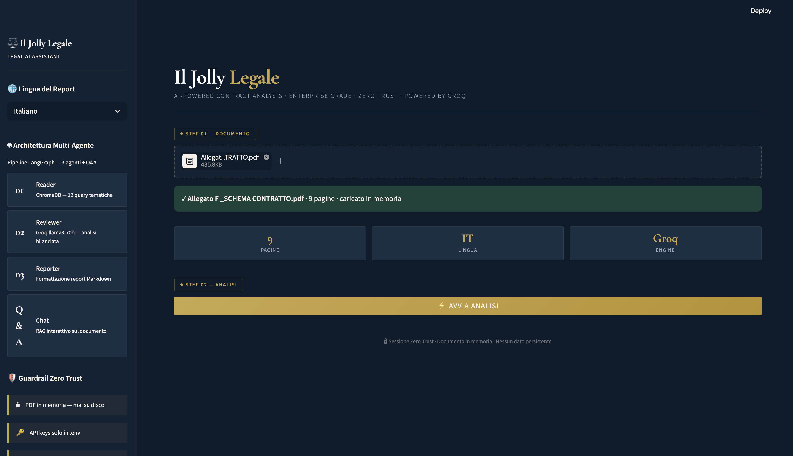

# ⚖️ Il Jolly Legale
### AI-Powered Contract Analysis — Enterprise Grade · Zero Trust · Zero Cost



---

## 🏆 VANTAGGIO COMPETITIVO

> **I tuoi contratti non lasciano mai il tuo computer.**
> **L'intelligenza artificiale arriva a te — non il contrario.**

La maggior parte dei tool di analisi legale AI funziona così:
il documento viene caricato su server remoti, indicizzato da terze parti,
e analizzato da modelli che potrebbero trattenere i dati per il training.

**Il Jolly Legale funziona diversamente — by design:**

| Componente | Approccio Standard | Il Jolly Legale |
|---|---|---|
| Embedding dei contratti | API remote (OpenAI, Cohere) | **Modello locale su CPU — zero trasmissione dati** |
| Indicizzazione vettoriale | Database cloud persistente | **ChromaDB in RAM — sparisce a sessione chiusa** |
| Inferenza LLM | Server remoti, latenza 10-30s | **Groq LPU — latenza sotto 2s, free tier** |
| Persistenza dati | Log server, fine-tuning | **Zero — nessun byte salvato su disco** |

### PRIVACY BY ARCHITECTURE, NON BY POLICY

Gli embeddings vengono generati localmente da
`paraphrase-multilingual-MiniLM-L12-v2` — un modello da 470MB
che gira interamente sulla tua macchina.
**Il testo del contratto non viaggia mai su nessuna API per la vettorializzazione.**

Groq riceve solo il contesto testuale necessario per rispondere —
nessun documento integrale, nessun metadato identificativo.

### GROQ LPU — L'UNICA ECCEZIONE GIUSTIFICATA

Groq non e' un cloud LLM qualsiasi.
Il suo Language Processing Unit e' hardware dedicato
all'inferenza neurale con latenza deterministica sub-secondo.
Su un contratto da 50 pagine, l'analisi completa avviene in **~25 secondi**
contro i 90-120 secondi dei competitor basati su GPU cloud.

---

## Architettura del Sistema

```
                    PDF CARICATO
                (bytes in RAM, mai su disco)
                          |
                    MODULO A - RAG
              pdfplumber + chunking 1500/400
          HuggingFace embeddings (100% locale)
              ChromaDB ephemeral (in RAM)
                          |
          ________________|________________
          |               |               |
    AGENTE READER   AGENTE REVIEWER  AGENTE REPORTER
    12 query su     Groq llama3-70b  Groq llama3-70b
    ChromaDB        Analisi rischi   Report Markdown
                    + opportunita'   PDF professionale
                          |
                 STEP 04 - Q&A INTERATTIVO
            Domanda -> ChromaDB (k=6) -> Groq
         Risposta ancorata al testo originale
```

---

## Setup da Zero

### 1. Prerequisiti

- Python 3.10+ → [python.org](https://www.python.org/downloads/)
- Chiave API Groq (gratuita) → [console.groq.com](https://console.groq.com)
- Git → [git-scm.com](https://git-scm.com/)
- Solo Mac: Homebrew → [brew.sh](https://brew.sh/)

### 2. Clona e Configura l'Ambiente

```bash
git clone <URL_DEL_TUO_REPO>
cd jolly-legale

python -m venv venv
source venv/bin/activate      # Mac/Linux
# oppure: venv\Scripts\activate  (Windows)
```

### 3. Installa le Dipendenze

```bash
pip install -r requirements.txt
```

Al primo avvio, `sentence-transformers` scarica il modello multilingua (~470MB).
Operazione una-tantum — poi e' in cache locale.

### 4. Configura le Variabili d'Ambiente

```bash
cp .env.example .env
```

Apri `.env` e compila:

```env
# Groq — gratuito su console.groq.com
GROQ_API_KEY="gsk_..."
LLM_MODEL="llama-3.3-70b-versatile"

# Chunking ottimizzato per testi legali
CHUNK_SIZE=1500
CHUNK_OVERLAP=400
```

`.env` e' nel `.gitignore` — non viene mai committato.

### 5. Avvia

```bash
streamlit run app.py
```

Apri il browser su `http://localhost:8501`

---

## Struttura del Progetto

```
jolly-legale/
├── app.py                  # UI Streamlit — zero logica AI
├── rag.py                  # Ingestione PDF, embeddings, Q&A
├── agents.py               # Pipeline LangGraph (3 agenti)
├── llm_utils.py            # Retry backoff — neutro, zero circular import
├── report_generator.py     # Markdown -> PDF professionale
├── fonts/                  # DejaVu Unicode (per fpdf2)
├── .streamlit/
│   └── config.toml         # Tema dark navy/oro
├── requirements.txt
├── .env.example
├── .gitignore
└── README.md
```

---

## Funzionalita'

**Analisi Automatica** — carica il PDF (fino a 30 pagine, troncamento automatico
oltre soglia) e ottieni in ~25 secondi un report con rischi classificati
(ALTO/MEDIO/BASSO), clausole favorevoli, sommario esecutivo e raccomandazioni
prioritizzate. Per contratti piu' lunghi e' disponibile l'infrastruttura Premium.

**Q&A Interattivo con Memoria** — dopo il report, interroga il contratto in linguaggio
naturale. Il retriever multilingua capisce sinonimi e parafrasi in italiano
(es. "subaffitto" trova "sublocazione"). La chat ricorda i turni precedenti:
puoi chiedere "me le puoi riassumere in tabella?" dopo una risposta e l'LLM capisce il riferimento.

**Report PDF Professionale** — stile studio legale: header riservato,
tabelle con word-wrap, numerazione pagine, colori navy/oro.

**Multilingua IT/EN** — selettore in sidebar che cambia lingua
sia dell'analisi che del report finale.

---

## Costo Operativo

| Voce | Costo |
|---|---|
| Embeddings (HuggingFace locale) | $0.00 |
| Vector DB (ChromaDB in RAM) | $0.00 |
| LLM Groq (free tier) | $0.00 |
| Totale per analisi | $0.00 |

Il free tier Groq include 14.400 richieste/giorno su llama-3.3-70b.
Per uso enterprise intensivo, il piano a pagamento parte da $0.59/1M token.

---

## Guardrail di Sicurezza

| Regola | Implementazione | Stato |
|---|---|---|
| PDF mai su disco | Elaborazione su io.BytesIO in RAM | OK |
| API keys in .env | python-dotenv + .gitignore | OK |
| Zero persistenza vettori | ChromaDB senza persist_directory | OK |
| Clean Architecture | UI separata dalla logica AI | OK |
| Eccezioni gestite | try/except con messaggi utente | OK |
| Dati embedding locali | HuggingFace su CPU, zero API call | OK |
| Limite pagine | Troncamento automatico a 30 pagine con avviso | OK |
| Memoria chat | ConversationBuffer in session_state, zero persistenza | OK |

---

## Tech Stack Completo

| Layer | Tecnologia | Ruolo |
|---|---|---|
| UI | Streamlit 1.35+ | Interfaccia dark navy/oro |
| LLM | Groq llama-3.3-70b-versatile | Ragionamento legale |
| Embeddings | paraphrase-multilingual-MiniLM-L12-v2 | Vettorializzazione locale |
| Orchestrazione | LangGraph + LangChain | Pipeline multi-agente |
| Vector DB | ChromaDB (ephemeral) | Retrieval semantico |
| Parsing PDF | pdfplumber + PyPDF2 | Estrazione testo dual-layer |
| Report PDF | fpdf2 + DejaVu Unicode | Generazione professionale |
| Retry | tenacity + llm_utils.py | Resilienza rate limit, zero circular import |
| Tema | Streamlit config.toml | Dark mode nativo |